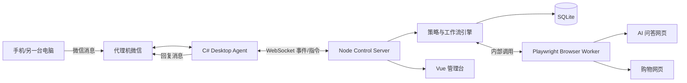
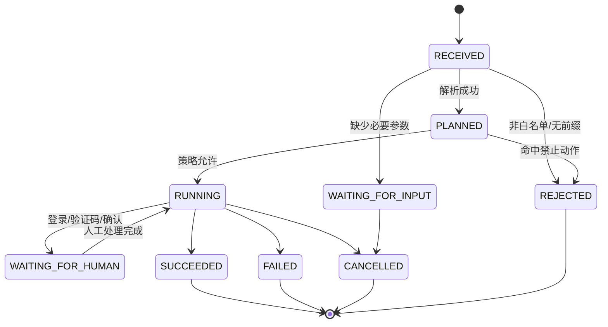

# 系统架构

## 1. 总体方案

系统采用单机分层架构。Node.js 控制服务是任务和策略的唯一事实源；C# Desktop Agent 专注 Windows 桌面能力；Playwright Worker 专注浏览器页面。两类执行器都只接受强类型、白名单动作。



## 2. 为什么这样拆分

- C#/.NET 对 Windows UI Automation、窗口句柄、剪贴板和 `SendInput` 支持直接。
- Node.js/TypeScript 与 Playwright 集成成熟，适合 DOM 自动化和快速编排。
- 工作流集中在 Control Server，避免 C# 和 Node 各自维护一套任务状态。
- SQLite 满足单代理机课程项目，无需引入数据库运维。
- 本地 HTTP/WebSocket 足够清晰，便于抓包、测试和答辩展示。

## 3. 组件职责

### 3.1 Control Server

- 接收 Agent 上报的聊天消息。
- 去重、解析命令、创建任务。
- 执行策略校验与状态机转换。
- 调度桌面动作或浏览器动作。
- 汇总结果并生成待回复文本。
- 提供管理 API、WebSocket 状态流和健康检查。
- 独占 SQLite 写入权。

建议模块：

```text
src/
  api/             # HTTP、WebSocket、鉴权
  application/     # 用例与任务编排
  domain/          # Task、Step、Policy、状态机
  adapters/
    browser/       # AI/购物站点适配器
    desktop/       # Desktop Agent 客户端
  infrastructure/ # SQLite、日志、配置
```

### 3.2 Desktop Agent

- 发现和连接指定 Windows 应用。
- 读取聊天窗口中的新消息。
- 驱动窗口、控件、键盘、鼠标和剪贴板。
- 截图并上报执行结果。
- 执行紧急停止热键。
- 拒绝未知动作、过期指令和重复指令。

当前 M1 模块边界：

```text
apps/desktop-agent/
  src/DesktopAgent.Core/    # 跨平台 DTO、连接、调度、去重和参数校验
  src/DesktopAgent/         # Console Host 和失败关闭的占位执行器
  src/DesktopAgent.Windows/ # 计划中的 FlaUI、Input、Clipboard、Screenshot
  tests/                     # 跨平台 xUnit 契约和安全测试
```

`DesktopAgent.Core` 和当前 Host 可在 macOS/Linux CI 中验证。真实 Windows 项目必须
引用 Core 并实现 `IDesktopActionExecutor`；FlaUI、窗口句柄、剪贴板、`SendInput`
和微信 Adapter 不得进入 Core。M0 完成前，占位执行器必须返回 `NOT_IMPLEMENTED`，
不得模拟执行成功。

### 3.3 Browser Worker

首期与 Control Server 同进程部署，逻辑上保持独立：

- 管理持久化浏览器上下文。
- 对 AI 页面执行提问和结果提取。
- 对购物页面执行检索和结构化抽取。
- 保存 Playwright trace、截图和页面诊断信息。
- 遇到验证码或登录失效时转为 `WAITING_FOR_HUMAN`。

每个站点实现独立 Adapter，不允许工作流直接使用 CSS 选择器。

### 3.4 Operator Web

- 展示 Agent 在线状态、当前任务和步骤时间线。
- 支持暂停接单、取消任务、紧急停止。
- 查看脱敏截图和失败原因。
- 配置联系人白名单、命令前缀、站点开关与保留期。

管理台只在本机开放。课程演示若需局域网访问，必须启用口令并限制来源地址。

## 4. 自动化策略

定位优先级：

1. **语义控件**：UIA `AutomationId/Name/ControlType`。
2. **DOM**：Playwright `getByRole/getByLabel/getByText`。
3. **锚点相对位置**：以可识别窗口或控件为基准。
4. **固定坐标**：仅限 PoC，必须校验分辨率、缩放和前台窗口。

每个动作执行前后都要断言页面/窗口状态。例如“点击发送”前确认前台进程是微信且输入框内容匹配，执行后确认消息出现在会话中。

## 5. 核心工作流



商品搜索工作流固定为：

1. `ParseShoppingRequest`
2. `ValidateShoppingPolicy`
3. `OpenShoppingSite`
4. `SearchProducts`
5. `ExtractCandidates`
6. `RankCandidates`
7. `SummarizeResults`
8. `SendChatReply`

AI 不得跳过、插入或改写这些步骤。

## 6. 意图理解方案

MVP 采用规则解析加可选 AI 补全：

- 命令前缀和动词由规则识别。
- 金额、数量等关键字段由确定性解析器提取。
- 仅当描述复杂时，把文本发送到 AI 页面转为候选结构。
- 候选结构必须通过 JSON Schema、业务范围和策略三重校验。
- 校验失败则向用户追问，不猜测预算、数量或高风险意图。

## 7. 排序策略

首期不声称“全网最优”，只在当次抓取候选中排序。默认评分：

```text
score =
  0.35 * preferenceMatch +
  0.25 * ratingScore +
  0.20 * salesScore +
  0.20 * priceScore
```

所有子分数归一化到 `[0, 1]`，页面缺失字段按中性值或降权处理，并在回复中说明排序范围和采集时间。

## 8. 可靠性机制

- 消息以 `source + conversationId + messageId` 幂等。
- 同一 Agent 默认串行执行任务，避免争夺鼠标和前台窗口。
- 步骤设置独立超时；仅只读且可幂等的步骤允许自动重试。
- 每次执行动作携带 `commandId` 和有效期，Agent 维护最近执行集合。
- Agent 使用 Server 下发的心跳间隔，连续缺失三次心跳后由 Server 标记离线。
- Agent 断线后按有上限的指数退避重连；新连接替换相同 Agent 的旧连接。
- 进程重启后运行中任务转为 `INTERRUPTED`，由管理员决定重试。
- UI 定位规则带 `adapterVersion`，便于定位软件升级造成的失败。

## 9. 安全边界

Control Server 在下发动作前和 Desktop Agent 在执行前各校验一次：

- 动作类型在白名单中。
- 目标进程、窗口标题和站点域名匹配允许列表。
- 不属于支付、转账、凭据读取、文件删除等禁止动作。
- 当前任务未取消且指令未过期。
- 需要确认的动作已存在有效确认记录。

紧急停止应同时做到：清空待执行队列、释放输入状态、停止浏览器步骤、暂停接收新任务。

## 10. 部署拓扑

MVP 所有组件运行在一台 Windows 11 代理机：

```text
Windows 11
├── WeChat Desktop
├── Chromium (Playwright persistent context)
├── DesktopAgent.exe
├── node control-server
├── operator-web static files
└── data/automation.db + artifacts/
```

不建议把控制服务部署到公网。远程用户通过聊天工具间接使用系统，降低网络和认证复杂度。
